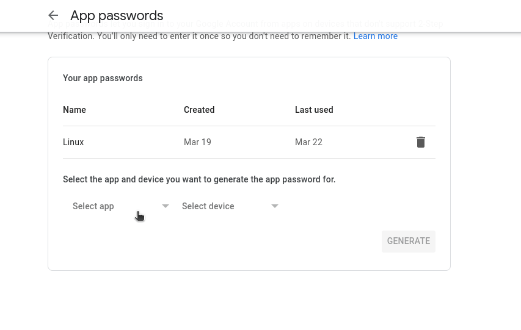
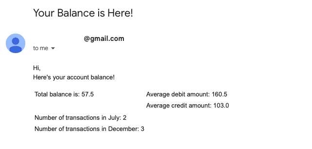

# Stori Tech Challenge


# Prerequisites

- [Python 3](https://www.python.org/downloads/)
- [Docker](https://docs.docker.com/docker-for-mac/install/)  
- [Google App Password](https://myaccount.google.com/u/0/apppasswords)


# Local development

- [Clone the repository](https://docs.github.com/es/repositories/creating-and-managing-repositories/cloning-a-repository)


- Get in the root folder of the project
    ```commandline
    cd stori-tech-challange
    ```
  
- Create a [Google App Password](https://myaccount.google.com/u/0/apppasswords)
for the email that it's going to send the emails and save it, 
it's going to be useful in some steps.

    

    *via: https://stackoverflow.com/questions/72493643/google-disabled-access-to-less-secure-apps#:~:text=The%20only%20workaround%20I%20have,sendmail%20%2B%20ESMTP%20then%20works%20again.*


 - Run in a terminal:
     ```
    cp .env.sample .env
    ```
 - Fill the environment variables in the new `.env` file
     ```properties
    CVS_FILE=<path/to/your/csv/file>
    ROW_NAMES=Id,Date,Transaction
    EMAIL_ADDRESS=<sender-email>
    EMAIL_PASSWORD=<the-google-app-password-from-before>
    SEND_TO=<email-receiver>
    SUBJECT=<email-subject>
    DB_NAME=stori
    DB_USER=postgres
    DB_PASS=secret
    DB_HOST=db
    DB_PORT=5432
    ```

 - Build the app:
    ```commandline
    docker-compose build
    ```

- Run the app:

    ```commandline
    docker-compose up
    ```
 
- Once the email is sent you'll see something like this:

    

